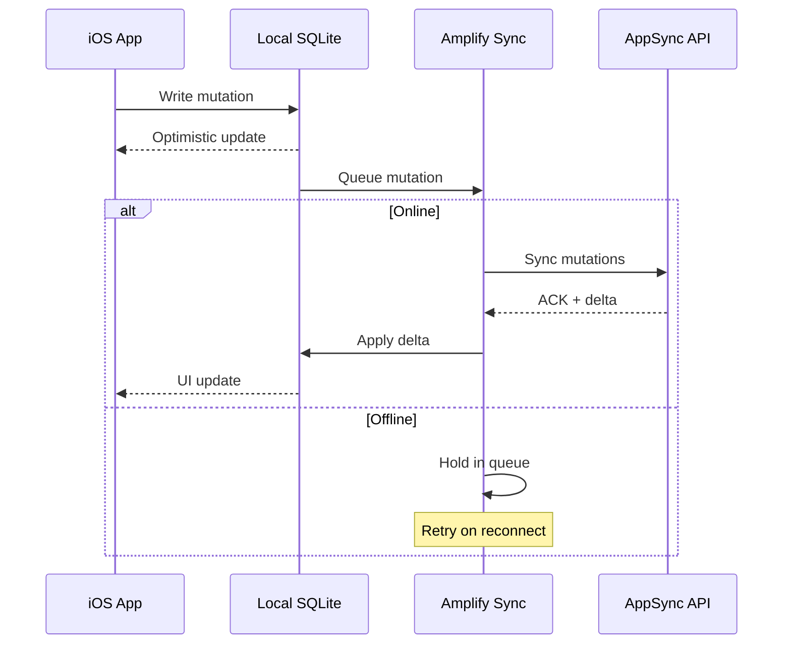

Based on my analysis of your iOS-AWS-Amplify-App codebase, here is a comprehensive README:

```markdown
# iOS AWS Amplify App

> A cloud-native, offline-first iOS application showcasing real-time GraphQL data synchronization with AWS Amplify.

## Overview

This project demonstrates a production-ready **Swift/SwiftUI** mobile architecture built on **AWS Amplify**, featuring:

- **GraphQL API** via AWS AppSync with automatic code generation
- **Offline-first datastore** with automatic synchronization
- **Real-time pub/sub** updates using Combine publishers
- **Serverless backend** with DynamoDB (pay-per-request billing)

## Technology Stack

| Layer | Technology |
|-------|-----------|
| **Frontend** | SwiftUI, iOS 13+, Combine |
| **SDK** | AWS Amplify, AmplifyPlugins |
| **API** | GraphQL (AppSync) |
| **Database** | Amazon DynamoDB (On-Demand) |
| **Sync** | Delta Sync, Optimistic Concurrency |
| **Real-time** | WebSocket Subscriptions |
| **Auth** | API Key (configurable) |

## Quick Start

### Prerequisites

- Xcode 12+
- CocoaPods
- AWS Account with Amplify CLI configured

### Installation

```bash
# Install dependencies
pod install

# Open workspace (required for CocoaPods)
open Todo.xcworkspace
```

### Configuration

The app is configured via `amplify/backend/backend-config.json`:

```json
{
  "api": {
    "amplifyDatasource": {
      "service": "AppSync",
      "output": {
        "authConfig": {
          "defaultAuthentication": {
            "authenticationType": "API_KEY",
            "apiKeyConfig": {
              "apiKeyExpirationDays": 7
            }
          }
        }
      }
    }
  }
}
```

## GraphQL Schema

The app exposes a `Todo` model with full CRUD operations:

```graphql
type Todo {
  id: ID!
  name: String!
  priority: Priority
  description: String
  _version: Int!
  _deleted: Boolean
  _lastChangedAt: AWSTimestamp
  createdAt: AWSDateTime!
  updatedAt: AWSDateTime!
}

enum Priority {
  LOW
  NORMAL
  HIGH
}
```

### Auto-Generated Operations

| Operation | GraphQL | Purpose |
|-----------|---------|---------|
| **Queries** | `SyncTodos`, `GetTodo`, `ListTodos` | Fetch data with sync support |
| **Mutations** | `CreateTodo`, `UpdateTodo`, `DeleteTodo` | Modify records |
| **Subscriptions** | `OnCreateTodo`, `OnUpdateTodo`, `OnDeleteTodo` | Real-time updates |

## Architecture

### Initialization Flow

```
AppDelegate.application(_:didFinishLaunching:)
    │
    ├─> AWSAPIPlugin (GraphQL endpoint)
    │       └─> modelRegistration: AmplifyModels()
    │
    ├─> AWSDataStorePlugin (offline store + sync)
    │       └─> modelRegistration: AmplifyModels()
    │
    └─> Amplify.configure()
            └─> Logging level: .info
```

### Data Layer

**AppDelegate.swift:18-34** - Amplify initialization
```swift
let apiPlugin = AWSAPIPlugin(modelRegistration: AmplifyModels())
let dataStorePlugin = AWSDataStorePlugin(modelRegistration: AmplifyModels())

try Amplify.add(plugin: apiPlugin)
try Amplify.add(plugin: dataStorePlugin)
try Amplify.configure()
```

**ContentView.swift:28-36** - Real-time subscriptions
```swift
func subscribeTodos() {
    todoSubscription = Amplify.DataStore.publisher(for: Todo.self)
        .sink(receiveCompletion: { completion in
            print("Subscription completed: \(completion)")
        }, receiveValue: { mutationEvent in
            print("Mutation received: \(mutationEvent)")
        })
}
```

## Technical Deep Dive

### Offline-First Architecture

| Component | Behavior |
|-----------|----------|
| **Local Storage** | SQLite via SQLite.swift |
| **Sync Engine** | Delta Sync with version vectors (`_version`) |
| **Conflict Resolution** | Server-side wins (last-write-wins) |
| **Network Awareness** | Automatic queueing when offline |

### Data Sync Flow



### Subscription Model

The app uses Combine's `sink` pattern for reactive updates:

```swift
Amplify.DataStore.publisher(for: Todo.self)
    .sink { completion in
        // Handle subscription lifecycle
    } receiveValue: { mutationEvent in
        // Process: .create, .update, .delete
    }
```

**MutationEvent Types:**
- `.create` - New records from any client
- `.update` - Modifications (including sync merges)
- `.delete` - Soft deletes (`_deleted: true`)

### GraphQL Query Patterns

**Delta Sync Query** (incremental updates):
```graphql
query SyncTodos($lastSync: AWSTimestamp) {
  syncTodos(lastSync: $lastSync) {
    items { ... }
    nextToken
    startedAt
  }
}
```

**Filter Support**:
```graphql
query ListTodos($filter: ModelTodoFilterInput) {
  listTodos(filter: $filter) {
    items { ... }
  }
}
```

### DynamoDB Configuration

```json
{
  "DynamoDBBillingMode": "PAY_PER_REQUEST",
  "DynamoDBEnableServerSideEncryption": "false"
}
```

- **On-Demand Capacity** - Auto-scales read/write
- **No Provisioning** - Pay per actual usage
- **Single Table** - `Todo` table with GSI for queries

## Project Structure

```
iOS-AWS-Amplify-App/
├── amplify/
│   └── backend/
│       ├── api/amplifyDatasource/
│       │   ├── parameters.json
│       │   └── transform.conf.json
│       └── backend-config.json
├── graphql/
│   ├── schema.json           # Introspection schema
│   ├── queries.graphql       # Generated queries
│   ├── mutations.graphql     # Generated mutations
│   └── subscriptions.graphql # Generated subscriptions
├── Todo/
│   ├── AppDelegate.swift     # Amplify setup
│   ├── SceneDelegate.swift
│   └── ContentView.swift     # UI + subscriptions
├── Podfile
├── Podfile.lock
└── Todo.xcodeproj/
```

## Key Highlights

### Cloud-Native Integration
- **Amplify CLI** manages infrastructure as code
- **CloudFormation** stack deploys AppSync + DynamoDB
- **Code Generation** produces Swift models from GraphQL

### Real-Time Synchronization
- **WebSocket** connections for instant updates
- **Pub/Sub pattern** via `DataStore.publisher(for:)`
- **Multi-client sync** across all devices

### Offline-First Design
- **Local-first writes** with optimistic UI
- **Automatic retry** on network restoration
- **Graceful degradation** without user intervention

### Mobile Architecture
- **SwiftUI** for declarative UI
- **Combine** for reactive data flow
- **Scene-based lifecycle** for iPadOS multitasking

## Development Workflow

### Modify GraphQL Schema

1. Edit schema in `amplify/backend/api/amplifyDatasource/schema.graphql`
2. Run `amplify api codegen models`
3. Rebuild `AmplifyModels` registration

### Debugging

Enable verbose logging in `AppDelegate.swift:23`:
```swift
Amplify.Logging.logLevel = .verbose
```

### Testing Offline Behavior

1. Run app in iOS Simulator
2. Toggle network via Device > Network Condition Link
3. Verify operations queue/resume

## TODO

### Core Features
- [ ] Implement full CRUD UI (create/update/delete todos)
- [ ] Add user authentication (Cognito User Pools)
- [ ] Implement pagination for large datasets
- [ ] Add error handling and retry logic
- [ ] Support multiple priority levels with UI filters

### Architecture
- [ ] Extract DataStore operations to Repository layer
- [ ] Implement dependency injection pattern
- [ ] Add unit tests for business logic
- [ ] Create snapshot tests for SwiftUI views
- [ ] Add CI/CD pipeline with Fastlane

### Performance
- [ ] Implement query result caching
- [ ] Add pagination for `listTodos` queries
- [ ] Optimize subscription handling with debouncing
- [ ] Profile memory usage with large datasets
- [ ] Add performance monitoring (Pinpoint)

### Security
- [ ] Rotate API keys automatically
- [ ] Implement field-level authorization
- [ ] Add request signing (IAM auth)
- [ ] Enable DynamoDB server-side encryption
- [ ] Add certificate pinning for AppSync

### UX Enhancements
- [ ] Pull-to-refresh functionality
- [ ] Sync status indicator (syncing/synced/error)
- [ ] Offline mode banner
- [ ] Conflict resolution UI
- [ ] Dark mode support

### Infrastructure
- [ ] Multi-environment support (dev/staging/prod)
- [ ] Environment variable management
- [ ] Automated GraphQL schema migrations
- [ ] Backup/restore procedures
- [ ] CloudWatch dashboards for monitoring

## License

Copyright © 2020. All rights reserved.

## Resources

- [AWS Amplify iOS Documentation](https://docs.amplify.aws/lib/q/platform-ios/)
- [AppSync Documentation](https://docs.aws.amazon.com/appsync/)
- [GraphQL Code Generator](https://docs.amplify.aws/cli/graphql/codegen/)
- [SwiftUI Combine Integration](https://developer.apple.com/documentation/swui/combining)
```
